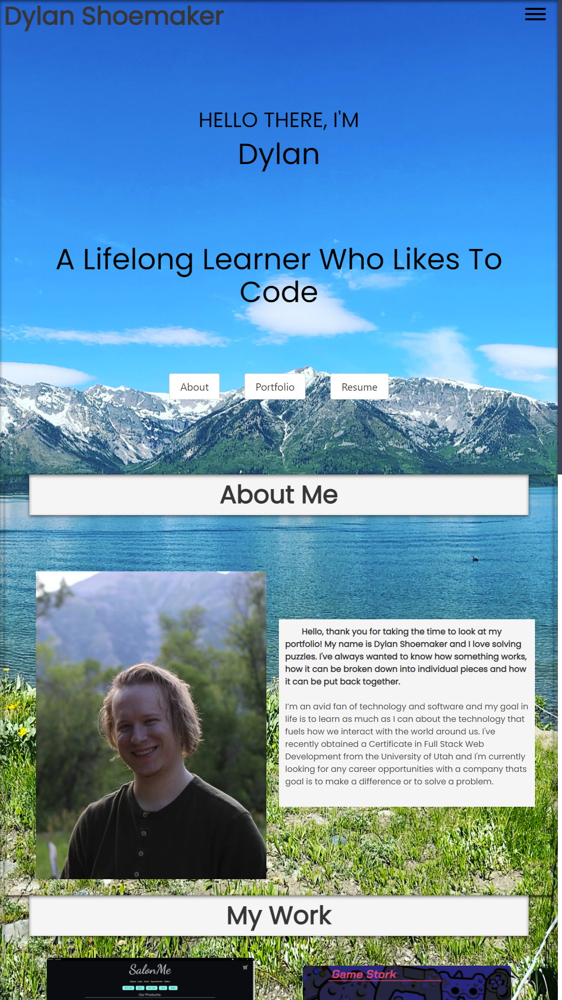

# React Portfolio

# Description
Professional Portfolio uses React resulting in a webpage that will work on any screen by utilizing mobile-first design. Live site demo: [Dylan Shoemaker's Portfolio](https://dylanshoemaker.github.io/react-portfolio/)

# Technologies Used 
- React
- Node.js

# Usage

# License

> This project is using the MIT license.
